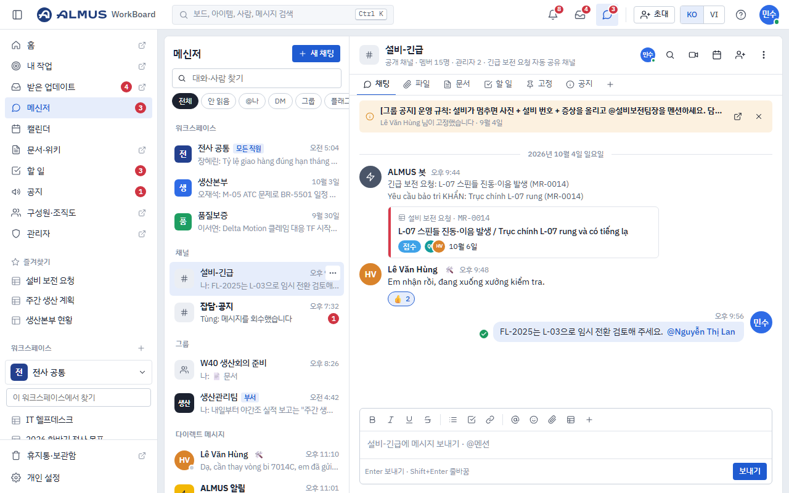
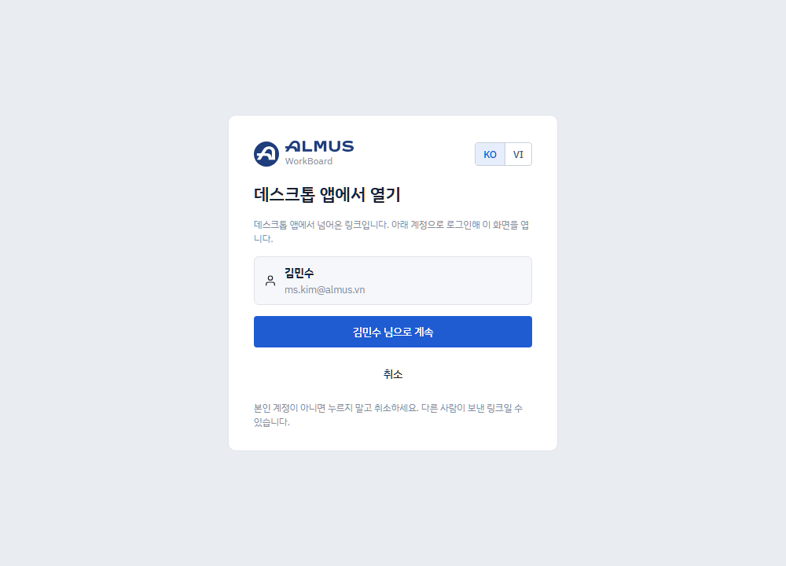
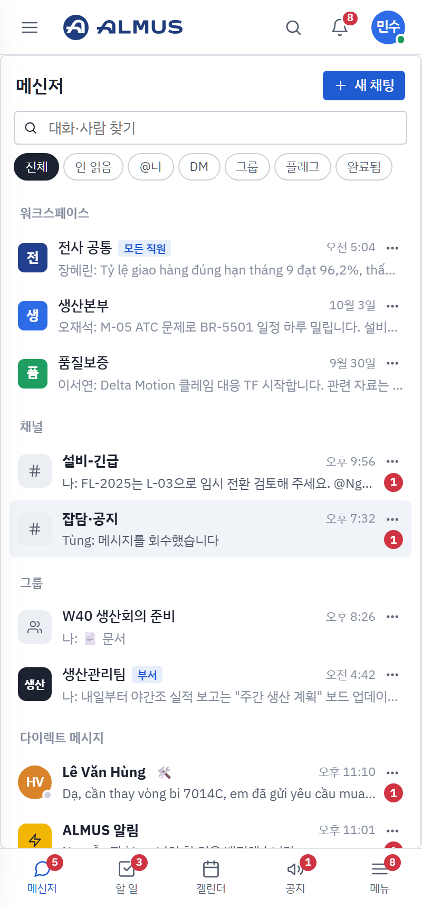
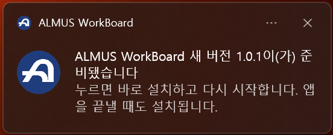

# ALMUS WorkBoard

## 기능 소개

- **Windows 데스크톱 앱**: 메신저·할 일·캘린더·공지·알림을 앱 창에서 바로 씁니다. 문서·보드·워크스페이스(사이드바의 ↗ 표시)는 브라우저에서 열리고, 처음 한 번 "○○ 님으로 계속"을 누르면 다시 로그인하지 않습니다. 창을 닫아도 트레이에서 새 메시지를 알려 줍니다.
- **Android 휴대폰 앱**: 메신저·할 일·캘린더·공지를 휴대폰에서 씁니다.

 

## 설치

**[최신 버전 받기](https://github.com/batman3101/almus-workboard-releases/releases/latest)**

- **Windows**: `ALMUS-WorkBoard-Setup-<버전>.exe`를 받아 두 번 누르면 설치되고 바로 실행됩니다. "Windows의 PC 보호" 창이 뜨면 "추가 정보" → "실행"을 누르세요. 회사 이메일과 비밀번호로 로그인합니다.
- **Android**: `ALMUS-WorkBoard-<버전>.apk`를 휴대폰에서 열어 설치합니다("출처를 알 수 없는 앱" 허용을 물으면 허용).

## 업데이트

- **Windows**: 자동입니다. 새 버전이 나오면 앱이 뒤에서 내려받아 알려 주고, 알림을 누르면(또는 앱을 끝낼 때) 설치됩니다.

  

- **Android**: 새 버전의 APK를 같은 방법으로 설치하면 업데이트됩니다(데이터는 그대로).
